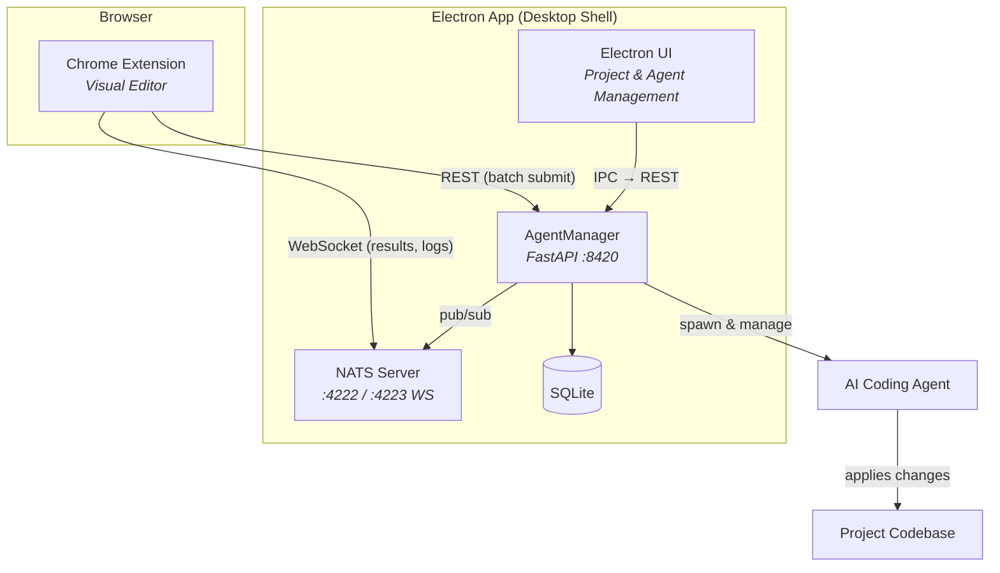

<p align="center">
  
</p>

<h1 align="center">Vex</h1>

<p align="center">
  <strong>Visual editing in the browser. AI-powered code changes in your codebase.</strong>
</p>

<p align="center">
  
  
  
  
  
  
  
  
  
</p>

<p align="center">
  <a href="#quick-start">Quick Start</a> &middot;
  <a href="#features">Features</a> &middot;
  <a href="#architecture">Architecture</a> &middot;
  <a href="#project-structure">Project Structure</a>
</p>

---

Vex is a visual web development tool that lets you edit live websites in your browser — resize elements, change styles, swap images, generate sections with AI — then sends those changes to an AI coding agent that applies them to your actual source code. It works with any framework: React, Vue, Svelte, Next.js, Django, plain HTML, or anything that renders in a browser.

## Features

- **Visual Element Editing** — select, resize, restyle, duplicate, move, wrap, and delete DOM elements directly in the browser
- **AI Section Generation** — describe a section in natural language and get generated HTML injected into the page
- **Image Replacement** — swap images via upload, URL, or AI generation
- **Style Copy** — copy visual properties between elements (text, box model, or all)
- **Framework Agnostic** — records pure visual intent; the AI agent writes idiomatic code for your specific stack
- **Batch Operations** — queue multiple edits and send them as a single batch to the agent
- **Real-time Feedback** — NATS-powered pub/sub delivers generation results and agent logs back to the extension instantly

## Architecture



**How it works:**

1. You visually edit elements in Chrome using the extension
2. Edits are captured as structured actions (12 types: select, insert, editText, delete, duplicate, move, wrap, resize, styleChange, replaceImage, generateSection, copyStyle)
3. Actions are batched and sent via REST to the AgentManager
4. The AgentManager routes tasks to AI coding agents that apply changes to your actual source files
5. Results and logs stream back to the extension in real-time via NATS WebSocket

## Quick Start

### Prerequisites

- Node.js 20+
- Python 3.11+ with [uv](https://github.com/astral-sh/uv)
- Chrome 116+
- [nats-server](https://nats.io) v2.10+

### Option A: Electron App (recommended)

The Electron app automatically manages NATS and AgentManager for you:

```bash
cd electron-app
npm install
npm run dev
```

Then load the Chrome extension (see below).

### Option B: Manual setup

```bash
# 1. Start NATS
nats-server -p 4222 --websocket_port 4223 --websocket_no_tls

# 2. Start AgentManager
cd agent-orchestrator
uv sync
uvicorn agent_orchestrator.main:app --reload --port 8420

# 3. Build & load the Chrome extension
cd chrome-extension
npm install
npm run dev
# Load in Chrome: chrome://extensions → Load unpacked → dist/
```

### Usage

1. Open any web project in Chrome with a running dev server
2. Click the Vex extension icon to activate the visual editor
3. Select elements, resize, restyle, generate sections, swap images
4. Click **Send** to batch your edits to the AI agent
5. The agent applies the changes to your source code

## Configuration

| Component | Port | Protocol | Purpose |
|-----------|------|----------|---------|
| AgentManager | 8420 | HTTP | REST API |
| NATS | 4222 | NATS | Message broker |
| NATS WebSocket | 4223 | WS | Browser client |

**Default paths:**

| Path | Purpose |
|------|---------|
| `~/.vex/vex.db` | SQLite database |
| `~/.vex/data/{projectId}/` | Screenshots and project data |

## Project Structure

```
vex/
├── chrome-extension/          # Chrome Extension (Manifest V3)
│   ├── src/
│   │   ├── content/           # Visual editor — main App, hooks, components
│   │   ├── popup/             # Extension popup UI
│   │   ├── background/        # Service worker
│   │   └── shared/            # Types (12 action types) and messages
│   └── manifest.json
│
├── agent-orchestrator/        # AgentManager (Python)
│   └── src/agent_orchestrator/
│       ├── api/               # REST endpoints
│       ├── models/            # Pydantic schemas
│       ├── services/          # Agent lifecycle, NATS, project detection
│       ├── adapters/          # Pluggable agent launchers
│       └── db/                # SQLite schema and connection
│
├── electron-app/              # Desktop Shell (Electron + React)
│   └── src/
│       ├── main/              # Process manager, IPC, window creation
│       └── renderer/          # React UI for project & agent management
│
└── specs/                     # Feature specifications and contracts
    └── 001-vex-visual-editor/
        └── contracts/         # REST API and NATS subject specs
```

## Tech Stack

| Component | Technologies |
|-----------|-------------|
| Chrome Extension | TypeScript, React 18, Vite, GSAP, CodeMirror 6, NATS.js |
| AgentManager | Python 3.11+, FastAPI, aiosqlite, nats-py, Pydantic |
| Electron App | TypeScript, Electron 30, React 18, Vite |
| Messaging | NATS v2.10+ (native + WebSocket) |
| Storage | SQLite (local), PostgreSQL (planned for k8s) |

## Contributing

1. Fork the repository
2. Create your feature branch (`git checkout -b feature/amazing-feature`)
3. Commit your changes
4. Push to the branch (`git push origin feature/amazing-feature`)
5. Open a Pull Request

## License

All rights reserved.
