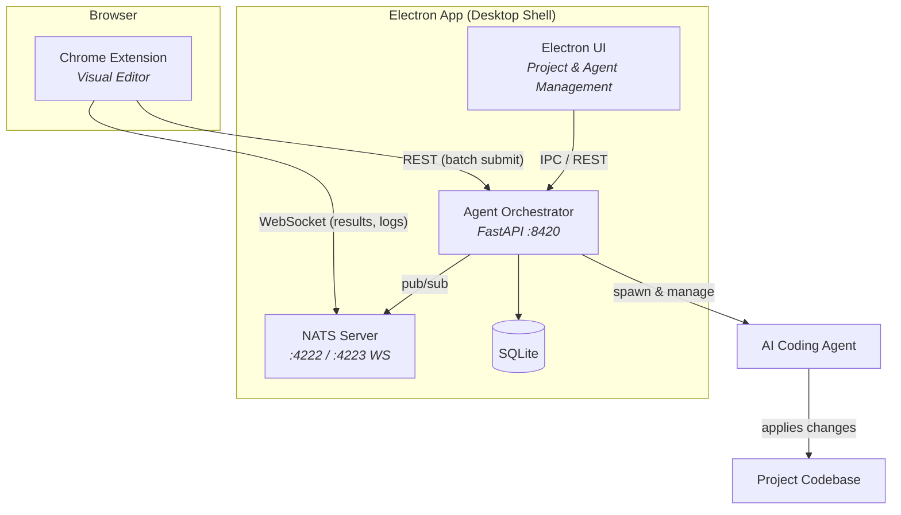

<p align="center">
  
</p>

<h1 align="center">Vex</h1>

<p align="center">
  <strong>Visual editing in the browser. AI-powered code changes in your codebase.</strong>
</p>

<p align="center">
  <a href="https://github.com/lukaskellerstein/vex"></a>
  <a href="https://www.typescriptlang.org/"></a>
  <a href="https://react.dev/"></a>
  <a href="https://www.python.org/"></a>
  <a href="https://fastapi.tiangolo.com/"></a>
  <a href="https://www.electronjs.org/"></a>
  <a href="https://nats.io/"></a>
  <a href="https://vite.dev/"></a>
  <a href="https://www.sqlite.org/"></a>
  <a href="https://developer.chrome.com/docs/extensions/mv3/"></a>
</p>

<p align="center">
  <a href="#quick-start">Quick Start</a> &middot;
  <a href="#features">Features</a> &middot;
  <a href="#architecture">Architecture</a> &middot;
  <a href="#api-reference">API Reference</a> &middot;
  <a href="#project-structure">Project Structure</a> &middot;
  <a href="#contributing">Contributing</a>
</p>

---

Vex is a visual web development tool that lets you edit live websites in your browser — resize elements, change styles, swap images, generate sections with AI — then sends those changes to an AI coding agent that applies them to your actual source code. It works with any framework: React, Vue, Svelte, Next.js, Django, plain HTML, or anything that renders in a browser.

## Features

- **Visual Element Editing** — select, resize, restyle, duplicate, move, wrap, and delete DOM elements directly in the browser
- **AI Section Generation** — describe a section in natural language and get generated HTML injected into the page
- **Image Replacement** — swap images via upload, URL, or AI generation
- **Style Copy** — copy visual properties between elements (text, box model, or all)
- **Framework Agnostic** — records pure visual intent; the AI agent writes idiomatic code for your specific stack
- **Batch Operations** — queue multiple edits and send them as a single batch to the agent
- **Real-time Feedback** — NATS-powered pub/sub delivers generation results and agent logs back to the extension instantly

## Architecture



**How it works:**

1. You visually edit elements in Chrome using the extension
2. Edits are captured as structured actions (12 types: select, insert, editText, delete, duplicate, move, wrap, resize, styleChange, replaceImage, generateSection, copyStyle)
3. Actions are batched and sent via REST to the Agent Orchestrator
4. The Agent Orchestrator routes tasks to AI coding agents that apply changes to your actual source files
5. Results and logs stream back to the extension in real-time via NATS WebSocket

## Quick Start

### Prerequisites

| Requirement | Version |
|-------------|---------|
| [Node.js](https://nodejs.org/) | 20+ |
| [Python](https://www.python.org/) | 3.11+ |
| [uv](https://github.com/astral-sh/uv) | latest |
| [Chrome](https://www.google.com/chrome/) | 116+ |

### Option A: Electron App (recommended)

The Electron app automatically manages NATS and the Agent Orchestrator for you:

```bash
cd electron-app
npm install
npm run dev
```

Then load the Chrome extension (see below).

### Option B: Dev setup script

Starts all three components as separate processes with unified logging:

```bash
./dev-setup.sh
```

Customize ports if needed:

```bash
./dev-setup.sh --ao-port 9000 --nats-port 5222 --nats-ws-port 5223
```

Logs are written to `/tmp/vex-logs/` (`nats.log`, `ao.log`, `electron.log`). Press `Ctrl+C` to stop everything.

### Option C: Manual setup

```bash
# 1. Start NATS
nats-server -p 4222 --websocket_port 4223 --websocket_no_tls

# 2. Start Agent Orchestrator
cd agent-orchestrator
uv sync
uv run uvicorn agent_orchestrator.main:app --reload --port 8420

# 3. Build & load the Chrome extension
cd chrome-extension
npm install
npm run dev
# Load in Chrome: chrome://extensions -> Load unpacked -> dist/
```

### Loading the Chrome Extension

1. Navigate to `chrome://extensions`
2. Enable **Developer mode** (toggle in top right)
3. Click **Load unpacked**
4. Select `chrome-extension/dist/`

### Usage

1. Open any web project in Chrome with a running dev server
2. Click the Vex extension icon to activate the visual editor
3. Select elements, resize, restyle, generate sections, swap images
4. Click **Send** to batch your edits to the AI agent
5. The agent applies the changes to your source code

## Configuration

### Ports

| Component | Port | Protocol | Purpose |
|-----------|------|----------|---------|
| Agent Orchestrator | 8420 | HTTP | REST API |
| NATS | 4222 | NATS | Message broker (server-to-server) |
| NATS WebSocket | 4223 | WS | Browser client messaging |
| Vite Dev Server | 5199 | HTTP/WS | HMR for Electron renderer |
| Electron DevTools | 9222 | CDP | Remote debugging |

### Data Paths

| Path | Purpose |
|------|---------|
| `~/.vex/vex.db` | SQLite database (WAL mode) |
| `~/.vex/data/{projectId}/` | Screenshots and project data |
| `/tmp/vex-logs/` | Development session logs |

### Environment

All ports are configurable via `dev-setup.sh` flags or by setting them directly when running components individually. The Agent Orchestrator reads its configuration from SQLite (`~/.vex/vex.db`) and exposes `GET/PATCH /api/config` endpoints for runtime updates.

## API Reference

The Agent Orchestrator exposes a REST API on port 8420. All endpoints are prefixed with `/api`.

### Health & Config

| Method | Endpoint | Description |
|--------|----------|-------------|
| `GET` | `/api/health` | Health check (DB, uptime, NATS status) |
| `GET` | `/api/config` | Get global configuration |
| `PATCH` | `/api/config` | Update global configuration |

### Projects

| Method | Endpoint | Description |
|--------|----------|-------------|
| `GET` | `/api/projects` | List all projects |
| `POST` | `/api/projects` | Create project (auto-detects framework) |
| `GET` | `/api/projects/{id}` | Get project details |
| `PATCH` | `/api/projects/{id}` | Update project |
| `DELETE` | `/api/projects/{id}` | Delete project |

### Batches

| Method | Endpoint | Description |
|--------|----------|-------------|
| `POST` | `/api/projects/{id}/batches` | Submit a new batch of actions |
| `GET` | `/api/projects/{id}/batches` | List batches for project |
| `GET` | `/api/projects/{id}/batches/latest` | Get latest batch with actions |
| `GET` | `/api/projects/{id}/batches/{bid}` | Get batch details |
| `GET` | `/api/projects/{id}/batches/{bid}/tasks` | Get tasks for batch |
| `GET` | `/api/batches/{bid}/trace` | Get agent traces for batch |
| `DELETE` | `/api/projects/{id}/batches/{bid}` | Delete batch |

### Agents

| Method | Endpoint | Description |
|--------|----------|-------------|
| `GET` | `/api/agents` | List all agents |
| `GET` | `/api/projects/{id}/agents` | List agents for project |
| `POST` | `/api/agents` | Register new agent |
| `GET` | `/api/agents/{id}` | Get agent details |
| `POST` | `/api/agents/{id}/start` | Start agent |
| `POST` | `/api/agents/{id}/stop` | Stop agent |
| `GET` | `/api/agents/{id}/trace` | Get latest agent trace |
| `GET` | `/api/agents/{id}/steps` | Get agent execution steps |
| `GET` | `/api/agents/{id}/logs` | Get agent logs |
| `DELETE` | `/api/agents/{id}` | Deregister agent |

### Tasks

| Method | Endpoint | Description |
|--------|----------|-------------|
| `GET` | `/api/tasks` | List tasks (filterable) |
| `POST` | `/api/tasks` | Create task (auto-routes to agent) |
| `GET` | `/api/tasks/pending` | List pending tasks |
| `GET` | `/api/tasks/{id}` | Get task details |
| `POST` | `/api/tasks/{id}/result` | Submit task result |

### Activity & Storage

| Method | Endpoint | Description |
|--------|----------|-------------|
| `GET` | `/api/activity` | List activity events |
| `GET` | `/api/activity/stats` | Get activity statistics |
| `GET` | `/api/storage/stats` | Get storage usage |
| `GET` | `/api/storage/screenshot` | Serve screenshot file |
| `DELETE` | `/api/storage/screenshots` | Clear all screenshots |

## Project Structure

```
vex/
├── chrome-extension/              # Chrome Extension (Manifest V3)
│   ├── src/
│   │   ├── content/               # Visual editor — main App, hooks, components
│   │   ├── popup/                 # Extension popup UI
│   │   ├── background/            # Service worker
│   │   └── shared/                # Types (12 action types) and messages
│   └── manifest.json
│
├── agent-orchestrator/            # Agent Orchestrator (Python FastAPI)
│   └── src/agent_orchestrator/
│       ├── api/                   # REST endpoints (projects, batches, agents, tasks)
│       ├── models/                # Pydantic schemas
│       ├── services/              # Agent lifecycle, NATS, batch processing
│       ├── adapters/              # Pluggable agent launchers (Claude SDK, CLI)
│       └── db/                    # SQLite schema and async connection
│
├── electron-app/                  # Desktop Shell (Electron + React)
│   └── src/
│       ├── main/                  # Process manager, IPC, window creation
│       └── renderer/              # React UI for project & agent management
│
├── specs/                         # Feature specifications and contracts
│   ├── 001-vex-visual-editor/
│   ├── 002-first-full-run/
│   ├── 003-full-run-with-extension-fixes/
│   ├── 004-dev-server-github-onboarding/
│   ├── 005-design-ui-overhaul/
│   └── 006-batch-agent-execution/
│
├── dev-setup.sh                   # One-command dev environment startup
└── GOAL.md                        # Full technical specification
```

## Tech Stack

| Component | Technologies |
|-----------|-------------|
| **Chrome Extension** | TypeScript 5.7, React 18, Vite 6, GSAP, CodeMirror 6, nats.ws |
| **Agent Orchestrator** | Python 3.11+, FastAPI 0.115, aiosqlite, nats-py, Pydantic 2.10, Claude Agent SDK |
| **Electron App** | TypeScript 5.7, Electron 30, React 18, Vite 6 |
| **Messaging** | NATS v2.10+ (native TCP + WebSocket) |
| **Storage** | SQLite with WAL mode (async via aiosqlite) |
| **Package Managers** | npm (JavaScript), uv (Python) |

## Development

### Commands

```bash
# Electron App
cd electron-app && npm install      # Install dependencies
cd electron-app && npm run dev      # Start dev mode
cd electron-app && npm run build    # Production build

# Chrome Extension
cd chrome-extension && npm install  # Install dependencies
cd chrome-extension && npm run dev  # Build with watch
cd chrome-extension && npm run build # Production build

# Agent Orchestrator
cd agent-orchestrator && uv sync    # Install dependencies
cd agent-orchestrator && uv run uvicorn agent_orchestrator.main:app --reload --port 8420  # Start dev
cd agent-orchestrator && uv run ruff check .   # Lint
cd agent-orchestrator && uv run pytest         # Test
```

### Debugging

The Electron app starts with remote debugging enabled on port 9222. You can connect Chrome DevTools or any CDP-compatible tool to inspect the renderer process.

Agent Orchestrator logs are available at `/tmp/vex-logs/ao.log` during dev sessions, and agent execution traces are persisted in SQLite for post-mortem analysis via the `/api/agents/{id}/trace` endpoint.

## Contributing

Contributions are welcome! Here's how to get started:

1. **Fork** the repository
2. **Create** your feature branch:
   ```bash
   git checkout -b feature/amazing-feature
   ```
3. **Set up** the dev environment:
   ```bash
   ./dev-setup.sh
   ```
4. **Make** your changes — follow the existing code style and conventions
5. **Test** your changes:
   ```bash
   # Python
   cd agent-orchestrator && uv run pytest
   cd agent-orchestrator && uv run ruff check .

   # Extension
   cd chrome-extension && npm run build
   ```
6. **Commit** your changes with a clear message:
   ```bash
   git commit -m "Add amazing feature"
   ```
7. **Push** to your branch:
   ```bash
   git push origin feature/amazing-feature
   ```
8. **Open** a Pull Request

### Guidelines

- **Python**: Follow [Ruff](https://docs.astral.sh/ruff/) defaults (Python 3.11 target, 100 char line length)
- **TypeScript**: Follow standard conventions with strict mode enabled
- **Commits**: Use imperative mood ("Add feature" not "Added feature")
- **PRs**: Keep them focused on a single concern; include a description of what and why

## License

All rights reserved.
