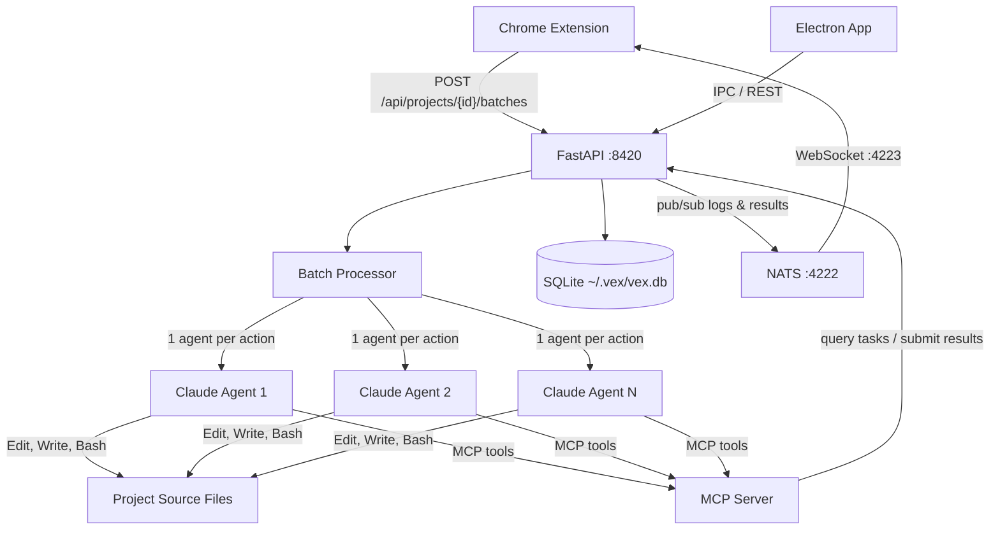

# Agent Orchestrator

[](https://python.org)
[](https://fastapi.tiangolo.com)
[](https://sqlite.org)
[](https://nats.io)

> FastAPI backend that orchestrates AI coding agents to translate visual UI edits into source code changes.

The Agent Orchestrator is the backend brain of **[Vex](../README.md)**. It receives batches of visual edits captured by the Chrome extension, spawns Claude AI agents in parallel to apply those changes to actual source files, and streams results back in real-time via NATS.

## Features

- **Parallel Agent Execution** -- spawns one AI agent per action for concurrent code generation
- **12 Action Types** -- select, insert, editText, delete, duplicate, move, wrap, resize, styleChange, replaceImage, generateSection, copyStyle
- **Framework Auto-Detection** -- identifies React, Vue, Svelte, Next.js, Django, and more from project files
- **Execution Traces** -- captures agent steps, tool calls, token usage, and cost per action
- **Plugin Marketplace** -- Git-based plugin system for extending agent capabilities
- **MCP Tool Server** -- exposes tools for agents to query pending work and submit results
- **Real-time Streaming** -- NATS pub/sub delivers agent logs and results to the Chrome extension

## Architecture



## Quick Start

### Prerequisites

- Python 3.11+
- [uv](https://docs.astral.sh/uv/) package manager
- NATS server running on port 4222

### Installation

```bash
cd agent-orchestrator
uv sync
```

### Run

```bash
uv run uvicorn agent_orchestrator.main:app --reload --port 8420
```

### Verify

```bash
curl http://localhost:8420/api/health
```

> **Tip:** In the full Vex setup, run `./dev-setup.sh` from the repo root -- it starts NATS, the orchestrator, and the Electron app together.

## Configuration

### Ports & Paths

| Setting | Default | Description |
|---------|---------|-------------|
| Port | `8420` | HTTP API port |
| NATS URL | `nats://localhost:4222` | NATS server connection |
| DB path | `~/.vex/vex.db` | SQLite database (WAL mode) |
| Data dir | `~/.vex/data/{projectId}/` | Screenshots and project data |
| Log dir | `~/.vex/logs/` | Agent execution logs |

### Agent Config (`config.json`)

Agent profiles, model selection, system prompts, allowed/disallowed tools, MCP server configs, and plugin references are defined in `config.json` at the project root.

## API Reference

All routes are prefixed with `/api`.

### Health & Config

| Method | Path | Description |
|--------|------|-------------|
| GET | `/health` | Health check (uptime, DB, NATS status) |
| GET | `/config` | Get global configuration |
| PATCH | `/config` | Update global configuration |

### Projects

| Method | Path | Description |
|--------|------|-------------|
| GET | `/projects` | List all projects |
| POST | `/projects` | Create project (auto-detects framework) |
| GET | `/projects/{id}` | Get project details |
| PATCH | `/projects/{id}` | Update project settings |
| DELETE | `/projects/{id}` | Delete project |

### Batches

| Method | Path | Description |
|--------|------|-------------|
| POST | `/projects/{id}/batches` | Submit batch of actions |
| GET | `/projects/{id}/batches` | List project batches |
| GET | `/projects/{id}/batches/{bid}` | Get batch with actions |
| GET | `/projects/{id}/batches/latest` | Get latest batch |
| GET | `/projects/{id}/batches/{bid}/tasks` | Get tasks for batch |
| GET | `/batches/{bid}/trace` | Get execution trace |
| DELETE | `/projects/{id}/batches/{bid}` | Delete batch |

### Tasks

| Method | Path | Description |
|--------|------|-------------|
| GET | `/tasks` | List tasks (filterable) |
| POST | `/tasks` | Create task (auto-routed) |
| GET | `/tasks/pending` | Pending tasks by capability |
| GET | `/tasks/{id}` | Get task details |
| POST | `/tasks/{id}/result` | Submit result (completed/failed) |

### Agents

| Method | Path | Description |
|--------|------|-------------|
| GET | `/agents` | List all agents |
| GET | `/projects/{id}/agents` | Project agents with stats |
| POST | `/agents` | Register agent |
| GET | `/agents/{id}` | Agent details |
| GET | `/agents/{id}/trace` | Latest trace with steps |
| GET | `/agents/{id}/steps` | Live or persisted steps |
| GET | `/agents/{id}/logs` | Agent logs (paginated) |
| POST | `/agents/{id}/heartbeat` | Send heartbeat |
| POST | `/agents/{id}/start` | Start agent |
| POST | `/agents/{id}/stop` | Stop agent |
| DELETE | `/agents/{id}` | Deregister agent |

### Activity & Storage

| Method | Path | Description |
|--------|------|-------------|
| GET | `/activity` | Activity events (filterable) |
| GET | `/activity/stats` | Aggregated stats (cost, counts) |
| GET | `/storage/stats` | DB and screenshot storage usage |
| GET | `/storage/screenshot?path=...` | Serve screenshot file |
| DELETE | `/storage/screenshots` | Clear all screenshots |

## Project Structure

```text
agent-orchestrator/
├── config.json                        # Agent profiles and plugin config
├── pyproject.toml                     # Dependencies (uv/hatch)
├── src/agent_orchestrator/
│   ├── main.py                        # FastAPI app entry point
│   ├── mcp_server.py                  # MCP tools for agents
│   ├── api/                           # REST API routers
│   │   ├── projects.py                # Project CRUD
│   │   ├── batches.py                 # Batch submission and retrieval
│   │   ├── agents.py                  # Agent lifecycle
│   │   ├── tasks.py                   # Task routing
│   │   ├── config.py                  # Health and config
│   │   ├── activity.py                # Activity events
│   │   └── storage.py                 # Screenshot storage
│   ├── models/                        # Pydantic schemas
│   │   ├── project.py                 # Project, ProjectStatus
│   │   ├── batch.py                   # Batch, ActionData (12 types)
│   │   ├── agent.py                   # Agent, AgentStatus
│   │   ├── task.py                    # Task, TaskStatus
│   │   ├── activity.py                # ActivityEvent
│   │   └── trace.py                   # AgentTrace, TraceStep
│   ├── services/                      # Business logic
│   │   ├── agent_manager.py           # Agent lifecycle and routing
│   │   ├── batch_processor.py         # Parallel action processing
│   │   ├── agent_logger.py            # Log to file and NATS
│   │   ├── nats_service.py            # NATS pub/sub
│   │   ├── marketplace.py             # Git-based plugin sync
│   │   ├── project_detector.py        # Framework auto-detection
│   │   ├── screenshot_store.py        # Screenshot persistence
│   │   └── task_router.py             # Task-to-agent routing
│   ├── adapters/                      # Agent implementations
│   │   ├── base.py                    # AgentAdapter ABC
│   │   ├── claude_code_sdk.py         # Claude Agent SDK adapter
│   │   └── cli_wrapper.py             # CLI-based adapter
│   └── db/
│       └── database.py                # SQLite schema and migrations
└── tests/
    └── test_agent_marketplace.py
```

## Development

### Lint

```bash
uv run ruff check .
```

### Test

```bash
uv run pytest
```

### Database

SQLite with WAL mode, async via aiosqlite. Schema auto-migrates on startup. Tables: `projects`, `batches`, `actions`, `tasks`, `agents`, `agent_traces`, `trace_steps`, `activity_events`, `config`.

## License

All rights reserved.
