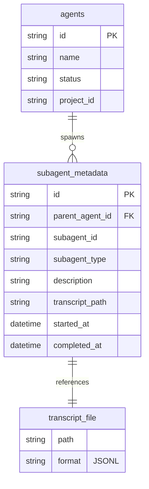
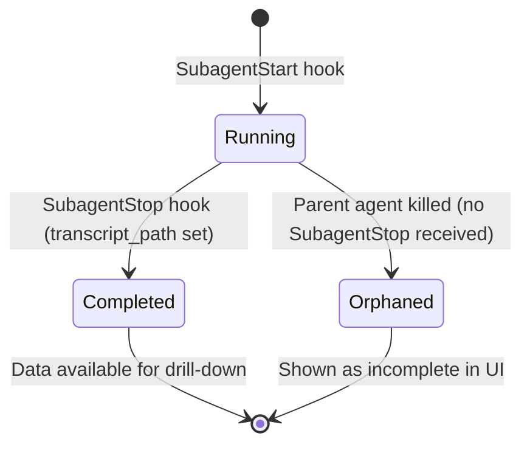

# Data Model: Subagent Drill-Down

## Entities

### SubagentMetadata

Represents a subagent spawned by a parent agent during execution.

| Field | Type | Constraints | Description |
|-------|------|-------------|-------------|
| id | string (UUID) | PK | Unique identifier |
| parent_agent_id | string | FK → agents.id, NOT NULL, INDEX | The agent that spawned this subagent |
| subagent_id | string | NOT NULL | Claude SDK's internal subagent identifier |
| subagent_type | string | NOT NULL | Subagent type (e.g., "general-purpose", "Explore") |
| description | string | NULL | Human-readable description (from spawn step metadata) |
| transcript_path | string | NULL | Absolute path to JSONL transcript file (set on completion) |
| started_at | datetime | NOT NULL | When the subagent was spawned |
| completed_at | datetime | NULL | When the subagent finished (NULL while running) |

**Indexes**:
- `idx_subagent_parent` on `parent_agent_id` (primary query pattern)
- `idx_subagent_sid` on `subagent_id` (lookup by SDK identifier)

**Lifecycle**:
1. INSERT on SubagentStart hook (id, parent_agent_id, subagent_id, subagent_type, started_at)
2. UPDATE on SubagentStop hook (transcript_path, completed_at)
3. CASCADE DELETE when parent agent is deleted

### TranscriptStep (derived, not persisted)

Parsed on-demand from JSONL transcript files. Maps to existing `TraceStep` interface.

| Field | Type | Description |
|-------|------|-------------|
| id | string | Generated from line index |
| sequence_index | int | Line position in transcript |
| type | string | Mapped step type (text, tool_call, tool_result, thinking, etc.) |
| content | string \| null | Text content or tool output |
| metadata | object \| null | Tool name, input, error flag, etc. |
| duration_ms | int \| null | Not available from transcript |
| token_count | int \| null | Not available from transcript |
| created_at | datetime | Timestamp from transcript record |

**Mapping from Claude SDK JSONL**:

| SDK Record | TranscriptStep type | Content source |
|------------|-------------------|----------------|
| `{"type": "start", ...}` | Skipped | — |
| `{"type": "config", ...}` | Skipped | — |
| `{"type": "event", "content": {"type": "text"}}` | `text` | `content.text` |
| `{"type": "event", "content": {"type": "thinking"}}` | `thinking` | `content.thinking` |
| `{"type": "event", "content": {"type": "tool_use"}}` | `tool_call` | `content.name`, `content.input` in metadata |
| `{"type": "event", "content": {"type": "tool_result"}}` | `tool_result` | `content.content`, `content.is_error` in metadata |
| `{"type": "finish", ...}` | `completed` | Status, cost, duration in metadata |

## Relationships

## State Transitions

