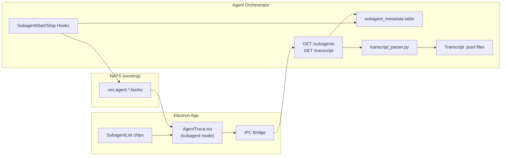

# Quickstart: Subagent Drill-Down

## Overview

This feature adds subagent visibility to the agent detail page. Users can see which subagents an agent spawned and drill into each subagent's full execution trace.

## Architecture

## Key Files to Modify

| Layer | File | Change |
|-------|------|--------|
| DB | `agent-orchestrator/.../db/database.py` | Add `subagent_metadata` table |
| Hooks | `agent-orchestrator/.../adapters/claude_code_sdk.py` | Persist to DB in SubagentStart/Stop handlers |
| Service | `agent-orchestrator/.../services/transcript_parser.py` | **New** — parse JSONL → TraceStep[] |
| API | `agent-orchestrator/.../api/agents.py` | 2 new endpoints |
| IPC | `electron-app/src/main/preload.ts` | 2 new methods |
| IPC | `electron-app/src/main/index.ts` | 2 new handlers |
| Types | `electron-app/src/renderer/electron.d.ts` | Type declarations |
| Route | `electron-app/src/renderer/App.tsx` | New subagent route |
| UI | `electron-app/src/renderer/pages/AgentTrace.tsx` | Subagent mode + SubagentList rendering |
| UI | `electron-app/src/renderer/components/project-detail/SubagentList.tsx` | **New** — chip row component |

## Implementation Order

1. **Database** — table + migration (no dependencies)
2. **Hook persistence** — SubagentStart → INSERT, SubagentStop → UPDATE (depends on 1)
3. **Transcript parser** — new service, standalone (no dependencies)
4. **API endpoints** — list + transcript (depends on 1, 3)
5. **Electron IPC** — bridge the 2 endpoints (depends on 4)
6. **Frontend** — route, SubagentList, AgentTrace subagent mode (depends on 5)

## Testing Strategy

- **Unit**: transcript_parser.py with sample JSONL fixtures
- **Integration**: API endpoints with seeded DB + fixture transcript files
- **E2E**: Run agent that spawns subagents, verify list + drill-down via Electron MCP
